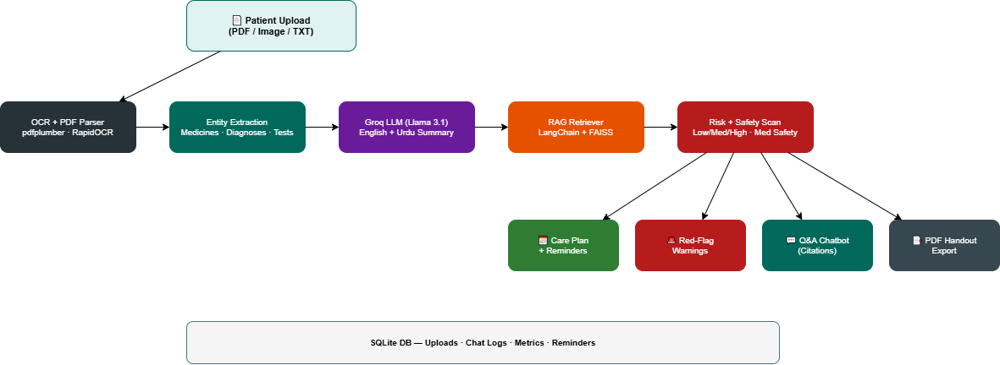

# 🏥 CarePath AI

**AI-powered patient recovery assistant delivering bilingual guidance, medication safety checks, and adherence support.**

[**Live Demo (Streamlit Cloud)**](https://carepath-ai.streamlit.app/)

[](https://www.python.org/)
[](https://fastapi.tiangolo.com/)
[](https://streamlit.io/)
[](LICENSE)

---

## 🎯 Problem Statement

**70% of medication non-adherence** cases occur because patients don't understand their discharge instructions. Complex medical documents, language barriers, and lack of follow-up clarity lead to:
- Missed medication doses
- Delayed follow-ups
- Preventable readmissions
- Patient confusion and anxiety

**CarePath AI solves this** by transforming clinical reports into clear, actionable, multilingual home-care guidance.

---

## 🚀 What CarePath AI Delivers

### Core Features
1. **📄 Bilingual Patient Summaries** – English + Urdu translations of complex medical text
2. **📅 Personalized Daily Care Plans** – Time-based schedules with medication, activity, and self-monitoring
3. **🔔 Smart Reminders** – Automated medication and follow-up alerts
4. **⚠️ Red-Flag Warnings** – Critical symptoms that require immediate medical attention
5. **💬 Grounded Q&A Chatbot** – Answers questions using uploaded report + approved knowledge base with citations
6. **📊 Explainable Risk Score** – Low/Medium/High adherence risk with human-readable factors
7. **🔍 Medication Safety Scanner** – Detects duplicates, high-dose patterns, and regimen complexity
8. **📈 Recovery Scorecard** – Multi-dimensional patient readiness metrics (adherence/follow-up/monitoring)
9. **🎮 Adherence Impact Simulator** – Interactive "what-if" tool with AI coaching tips
10. **📑 One-Click PDF Handout** – Downloadable patient take-home summary

### Advanced Capabilities
- **Doctor-Question Generator** – Auto-suggests personalized questions for next visit
- **Admin Analytics Dashboard** – Live metrics (latency, readability, citation coverage)
- **Clinical Entity Extraction** – Medicines, dosages, diagnoses, tests, follow-up dates
- **OCR Support** – PDF, images (PNG/JPG), and text files

> **Safety Notice:** All outputs include: *"Not a medical diagnosis; consult licensed doctor."*

---

## 🏗️ Architecture



**Pipeline:** Patient Upload → OCR + PDF Parser → Clinical Entity Extraction → Groq LLM (EN+Urdu Summary) → RAG Retriever (LangChain + FAISS) → Risk + Safety Scan → Care Plan · Red Flags · Q&A Chatbot · PDF Export → SQLite DB

### Tech Stack
| Layer | Technology |
|-------|-----------|
| **Frontend** | Streamlit |
| **Backend** | FastAPI + Pydantic |
| **ML/NLP** | scikit-learn, pandas, numpy, spaCy |
| **OCR** | pytesseract, pdfplumber |
| **RAG** | LangChain, FAISS |
| **LLM** | Groq (Llama 3.1), OpenAI/Gemini-ready |
| **Database** | SQLite |
| **Scheduler** | APScheduler |
| **PDF Export** | ReportLab |
| **Testing** | pytest |
| **Container** | Docker + docker-compose |

---

## ⚡ Quick Start (< 10 minutes)

### Prerequisites
- Python 3.11+
- Git
- (Optional) Docker

### Local Setup

1. **Clone repository**
```bash
git clone https://github.com/abdul-raheem-fast/carepath-ai.git
cd carepath-ai
```

2. **Create virtual environment**
```bash
python -m venv .venv
# Windows
.venv\Scripts\activate
# macOS/Linux
source .venv/bin/activate
```

3. **Install dependencies**
```bash
pip install -r requirements.txt
```

4. **Configure environment**
```bash
# Windows
copy .env.example .env
# macOS/Linux
cp .env.example .env
```

Edit `.env` and add your LLM key (optional; fallback works without key):
```env
DEFAULT_LLM_PROVIDER=groq
GROQ_API_KEY=your_key_here
GROQ_MODEL=llama-3.1-8b-instant
```

5. **Start backend** (Terminal 1)
```bash
uvicorn app.backend.main:app --reload --port 8000
```

6. **Start frontend** (Terminal 2)
```bash
streamlit run app/frontend/streamlit_app.py --server.port 8501
```

7. **Open app**
- 🌐 **App UI:** http://localhost:8501
- 📚 **API Docs:** http://localhost:8000/docs
- ✅ **Health:** http://localhost:8000/health

---

## 🐳 Docker Deployment

```bash
docker-compose up --build
```
- Backend: `http://localhost:8000`
- Frontend: `http://localhost:8501`

---

## 📊 Demo Flow (2-Minute Pitch)

1. **Upload sample report**
   - Use `sample_data/sample_report_hypertension_diabetes.pdf`
   
2. **View bilingual summaries**
   - English: patient-friendly simplification
   - Urdu: culturally appropriate translation

3. **Explore care plan**
   - Time-based daily schedule with medications
   - Recovery scorecard showing 4 readiness dimensions

4. **Check safety alerts**
   - Medication duplicates/complexity warnings
   - Red-flag symptoms requiring urgent care

5. **Test grounded chatbot**
   - Ask: *"When should I follow up and what are warning signs?"*
   - Observe: citations from uploaded report

6. **Simulate adherence**
   - Adjust slider (40%-100%)
   - See projected risk + coaching tips

7. **Download PDF handout**
   - One-click export for patient take-home

8. **View admin insights**
   - Live metrics: latency, readability, citation coverage

---

## 🧪 Testing

Run full test suite:
```bash
pytest -q
```

Test coverage:
- ✅ API endpoints (`/process`, `/chat`, `/simulate/adherence`, `/export/handout`)
- ✅ Entity extraction from clinical text
- ✅ Care plan generation
- ✅ PDF export validation

---

## 📁 Project Structure

```
carepath-ai/
├── app/
│   ├── backend/          # FastAPI routes, DB, config
│   │   ├── main.py
│   │   ├── db.py
│   │   ├── schemas.py
│   │   ├── config.py
│   │   ├── metrics.py
│   │   └── handout.py    # PDF generation
│   ├── frontend/         # Streamlit UI
│   │   └── streamlit_app.py
│   ├── ml/               # NLP, extraction, recommendation
│   │   ├── parser.py
│   │   ├── recommender.py
│   │   ├── risk.py
│   │   ├── llm.py
│   │   └── advanced_features.py
│   ├── rag/              # Retrieval-augmented generation
│   │   └── retriever.py
│   └── data/             # SQLite DB, uploads, knowledge base
├── tests/                # pytest suite
├── sample_data/          # Demo PDFs and reports
├── scripts/              # Seed, PDF generation helpers
├── docs/                 # Architecture diagrams
├── requirements.txt
├── Dockerfile
├── docker-compose.yml
└── README.md
```

---

## 🎓 Evaluation Metrics

The platform tracks:
- **Process Latency** (ms) – Upload-to-output time
- **Summary Readability Score** (0-100) – Patient comprehension estimate
- **Chat Citation Coverage** (0-1) – Grounded response ratio
- **Adherence Simulation** (%) – User-engagement metric

Access via: `GET /admin/insights`

---

## 🌐 Cloud Deployment

### Backend (Render)
1. New Web Service → connect GitHub repo
2. **Build:** `pip install -r requirements.txt`
3. **Start:** `uvicorn app.backend.main:app --host 0.0.0.0 --port 10000`
4. **Env vars:**
   - `DEFAULT_LLM_PROVIDER=groq`
   - `GROQ_API_KEY=<your_key>`
   - `LOG_LEVEL=INFO`

### Frontend (Streamlit Cloud)
1. New app → `app/frontend/streamlit_app.py`
2. **Secrets:**
   ```toml
   API_BASE_URL="https://your-backend.onrender.com"
   ```

---

## 🏆 Hackathon Highlights

### Generative AI Innovation
- Bilingual clinical text simplification (English + Urdu)
- Context-grounded Q&A with explicit source citations
- Real-time adherence simulation with LLM coaching

### Real-World Impact
- Reduces medication non-adherence through clarity + reminders
- Lowers preventable readmissions via red-flag education
- Supports multilingual patient populations (Pakistan, South Asia)

### Technical Implementation
- End-to-end OCR → extraction → generation → export pipeline
- Explainable risk scoring with human-readable factors
- Live observability metrics for quality assurance
- Reproducible: sample data + tests + Docker

### Documentation & Reproducibility
- ✅ Clear README with 10-minute setup
- ✅ Sample reports + seed script
- ✅ Test suite (5 passing tests)
- ✅ Docker Compose for one-command deployment
- ✅ API documentation at `/docs` endpoint

---

## 🔒 Security & Safety

- **No hardcoded secrets** – `.env` based configuration
- **Input validation** – File size limits, type checks
- **Synthetic data only** – No real patient health information (PHI)
- **Medical disclaimer** – All outputs include safety notice
- **Grounded responses** – Chatbot citations prevent hallucination

---

## 📜 License

MIT License - See [LICENSE](LICENSE) for details.

---

## 👥 Team

Built for [Generative AI Healthcare Hackathon 2026]

---

## 🔗 Links

- **Live Demo:** [Coming soon after deployment]
- **API Docs:** `{backend_url}/docs`
- **GitHub:** https://github.com/abdul-raheem-fast/carepath-ai
- **Contact:** abdulraheemghauri@gmail.com

---

## 🙏 Acknowledgments

- Groq for fast LLM inference
- Streamlit Community Cloud
- Render for backend hosting
- Open-source healthcare NLP community

---

**Made with ❤️ for better patient outcomes**