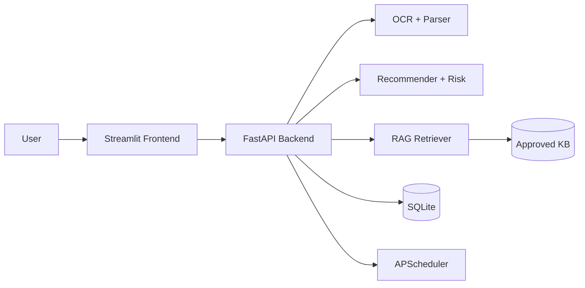

# CarePath AI Architecture

## Components
- `app/frontend`: Streamlit UI for upload, summary, care plan, and chat.
- `app/backend`: FastAPI API, DB access, scheduler, validation.
- `app/ml`: Text extraction, entity extraction, multilingual generation fallback, recommendation, risk score.
- `app/rag`: Context retrieval and citation snippets.
- `app/data`: SQLite DB, uploads, approved knowledge snippets.